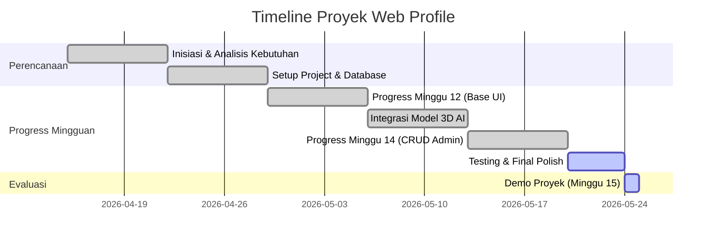

# Web Profile - Zahra Nurizza Afifah

## Identitas Mahasiswa
- **Nama:** Zahra Nurizza Afifah
- **NRP:** 5124500004
- **Kelas:** MMB-A

## Deskripsi
Project Laravel untuk tugas portofolio web profile interaktif (Web Profile Zahra). Web ini menampilkan identitas, keahlian, hobi, portofolio interaktif dengan model 3D AI di landing page, serta dashboard admin (CRUD) untuk manajemen portofolio dan pesan kontak.

---

## 📅 Timeline & Gantt Chart Pembuatan Proyek
*(Progress mingguan dipantau melalui commit GitHub dengan deskripsi perubahan)*

| Aktivitas / Fase | M11 | M12 (Progress 1) | M13 | M14 (Progress 2) | M15 (Demo) | Status |
| :--- | :---: | :---: | :---: | :---: | :---: | :---: |
| **Inisiasi & Analisis Kebutuhan** (Perencanaan, Desain UX) | ▓▓ | | | | | Selesai |
| **Setup Project Laravel** (Model, Database Migrations & Seeders) | ▓▓ | ▓▓ | | | | Selesai (M12) |
| **Fase Progress 1 (M12)** (Landing Page, Layout, Data Fallback) | | ▓▓ | | | | Selesai (M12) |
| **Integrasi Model 3D AI & Landing Page** (Asset Integration) | | | ▓▓ | | | Selesai |
| **Fase Progress 2 (M14)** (CRUD Admin Portofolio & Kontak) | | | ▓▓ | ▓▓ | | Selesai (M14) |
| **Testing & Bug Fixing** (Validasi Data, Uji Fitur Admin) | | | | ▓▓ | | Selesai |
| **Final Deploy & Demo (M15)** (Evaluasi & Demo Tugas Akhir) | | | | | ▓▓ | Siap Demo |

### Visualisasi Gantt Chart (Mermaid)


---

## 🔧 Cara Menjalankan
1. Clone repository ini:
   ```bash
   git clone https://github.com/zahranurizzaafifah/Web-Profile-Laravel.git
   cd Web-Profile-Laravel
   ```
2. Install dependensi composer:
   ```bash
   composer install
   ```
3. Copy environment file:
   - Di macOS/Linux: `cp .env.example .env`
   - Di Windows PowerShell: `Copy-Item .env.example .env`
4. Generate key aplikasi:
   ```bash
   php artisan key:generate
   ```
5. Setup database di `.env` (misal MySQL/SQLite) lalu migrasikan data & seeder:
   ```bash
   php artisan migrate --seed
   ```
6. Jalankan server lokal:
   ```bash
   php artisan serve
   ```

---

## 🚀 Fitur Utama Project
- **Landing Page Dinamis:** Menampilkan profil diri, hobi, dan keahlian langsung dari database / fallback data.
- **Visual Karakter 3D:** Integrasi `<model-viewer>` Google untuk menampilkan karakter 3D Astronaut interaktif pada landing page.
- **Halaman Tentang (About):** Deskripsi biodata lengkap Zahra Nurizza Afifah.
- **Halaman Portofolio:** Menampilkan proyek-proyek multimedia kreatif dengan visual card premium.
- **Admin Dashboard (CRUD):**
  - **Manajemen Portofolio:** Tambah, edit, dan hapus data portofolio.
  - **Manajemen Kontak:** Melihat pesan yang masuk dari pengunjung web.
- **AI Bubble Badge:** Sudut visual premium bertuliskan "AI by Zahra".

---

## 📋 Tips Struktur Laravel yang Dicek Otomatis
Sistem *Student Progress Reviewer* akan otomatis mendeteksi kelengkapan struktur file Laravel kamu berikut:
- [x] `composer.json`
- [x] `artisan`
- [x] Folder `app/`
- [x] `routes/web.php`
- [x] Folder `resources/views/`
- [x] Folder `database/migrations/`
- [x] `.env.example`
- [x] `README.md` (yang ini)

## ✅ Checklist sebelum push ke GitHub
- [ ] Repo sudah punya `README.md` di root
- [ ] Blok identitas (Nama / NIM / Kelas) ada di awal README
- [ ] Dosen sudah di-invite sebagai **collaborator** di Settings → Collaborators
- [ ] Invitation diterima oleh dosen

---
*Proyek Web Profile ini dikembangkan oleh **Zahra Nurizza Afifah** untuk memenuhi tugas mata kuliah Pemrograman Web Lanjut.*
